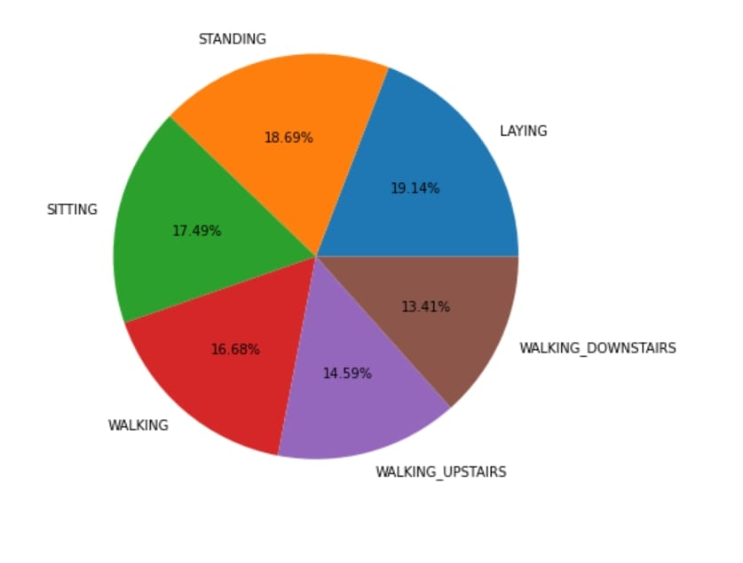

# Human Activity Recognization using various models
• Human Activity Recognition is the problem of predicting what a person is doing based on their movement using sensors.
• This projects aims to classify the type of movements from the 6 human activities WALKING, WALKING UPSTAIRS, WALKING DOWNSTAIRS, SITTING, STANDING, LAYING.
• The database has been built from the recordings of group of 30 volunteers within an age bracket of 19-48 years.
• Recognition is done by exploiting the information retrieved from Samsung Galaxy S2 smartphone which has embedded inertial sensors such as accelerometers and gyroscope for measuring 3-axial linear acceleration and angular velocity respectively at a constant rate of 50Hz, which is sufficient for capturing human body motion.
• Following are the algorithms used to predict the model-
Multiclass SVM (96% accuracy)
Random Forest Classifier (93% accuracy)
KNeighborsClassifier (89% accuracy)

The dataset of the problem statement has been taken from the kaggle dataset.
Download the dataset - https://www.kaggle.com/uciml/human-activity-recognition-with-smartphones

visualization: 

